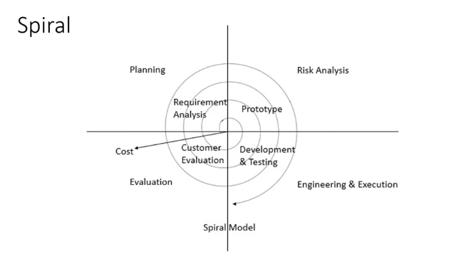
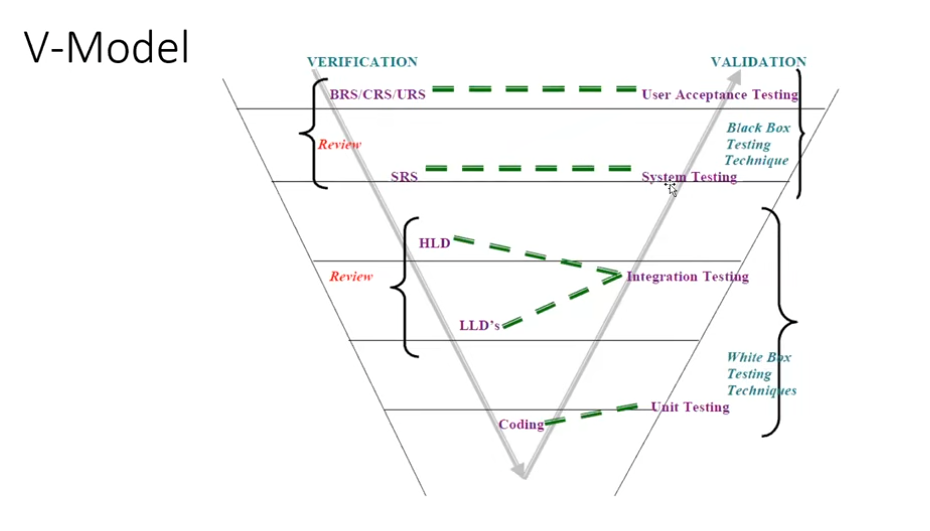

# SDLC - Software Development Life Cycle

The Software Development Life Cycle (SDLC) is a structured process used by software organizations to plan, design, develop, test, deploy, and maintain software.

## The 3 Ps of SDLC

1. **People** - The individuals involved in developing and maintaining the software.
2. **Process** - The methods and activities followed to build the software.
3. **Product** - The software created to meet user and business requirements.

## Phases of SDLC

### 1. Requirements Analysis

Gather, understand, and document the needs of users and the business.

### 2. Design

Define the software architecture, user interface, database, and technical solution.

### 3. Development

Write the source code according to the requirements and design.

### 4. Testing

Verify that the software works as expected and identify defects.

### 5. Deployment

Release the completed software to users or the production environment.

### 6. Maintenance

Fix defects, improve performance, and add updates after release.

#
# Waterfall Model

The Waterfall Model is a traditional Software Development Life Cycle (SDLC) model where each phase is completed before moving to the next phase.

## Phases of Waterfall Model

**Requirement Gathering**

**Analysis**

**Design**

**Coding (Development)**

**Testing**

**Deployment**

**Maintenance**

## Advantages of Waterfall Model
Quality of the product can be good when requirements are clear.

Since requirement changes are limited, the development process is straightforward.

Initial project cost may be lower because testing resources are involved later.

Suitable for small projects with fixed and well-defined requirements.

Easy to understand and manage.

## Disadvantages of Waterfall Model

Requirement changes are difficult to accommodate.

Defects introduced in early phases may be discovered very late.

Rework can increase project cost and development time.

Testing starts only after the development phase is completed.

Not suitable for large or frequently changing projects.

Customer feedback is received late in the development cycle.

## When to Use Waterfall Model?

Requirements are clear and stable.
Small-sized projects.
Projects with fixed scope and budget.
Government or compliance-driven projects with extensive documentation.

**Example**

A college management system where all requirements are finalized before development starts can be developed using the Waterfall Model.

#
# Spiral Model

Spiral Model is iterative model.

Spiral Model overcome drawbacks of Waterfall model.

We follow spiral model whenever there is dependency on the modules.

In every cycle new software will be released to customer.

Software will be released in multiple versions. So it is also called version control model.

## Advantages of Spiral Model

Testing is done in every cycle, before going to the next cycle.

Customer will get to use the software for every module.

Requirement changes are allowed after every cycle before going to the next cycle.

## Disadvantages of Spiral Model

Requirement changes are NOT allowed in between the cycle.

Every cycle of spiral model looks like waterfall model.

There is no testing in requirement & design phase.

# V-Model

The V-Model is an extension of the Waterfall Model where testing activities are planned and performed alongside each development phase.

The model is called V-Model because its structure resembles the letter "V".

Testing starts from the early stages of development, which helps identify defects sooner.

## Advantages of V-Model

Simple and easy to understand.

Testing starts early in the development lifecycle.

Defects are identified at an early stage.

Better quality product compared to Waterfall.

Suitable for projects with fixed requirements.

## Disadvantages of V-Model

Requirement changes are difficult to handle.

Not suitable for large and complex projects.

No working software is available until late stages.

Changes made after development starts can be expensive.

# Why is V-Model better than Waterfall?

Because testing activities are planned from the beginning, defects can be identified earlier, reducing cost and rework.